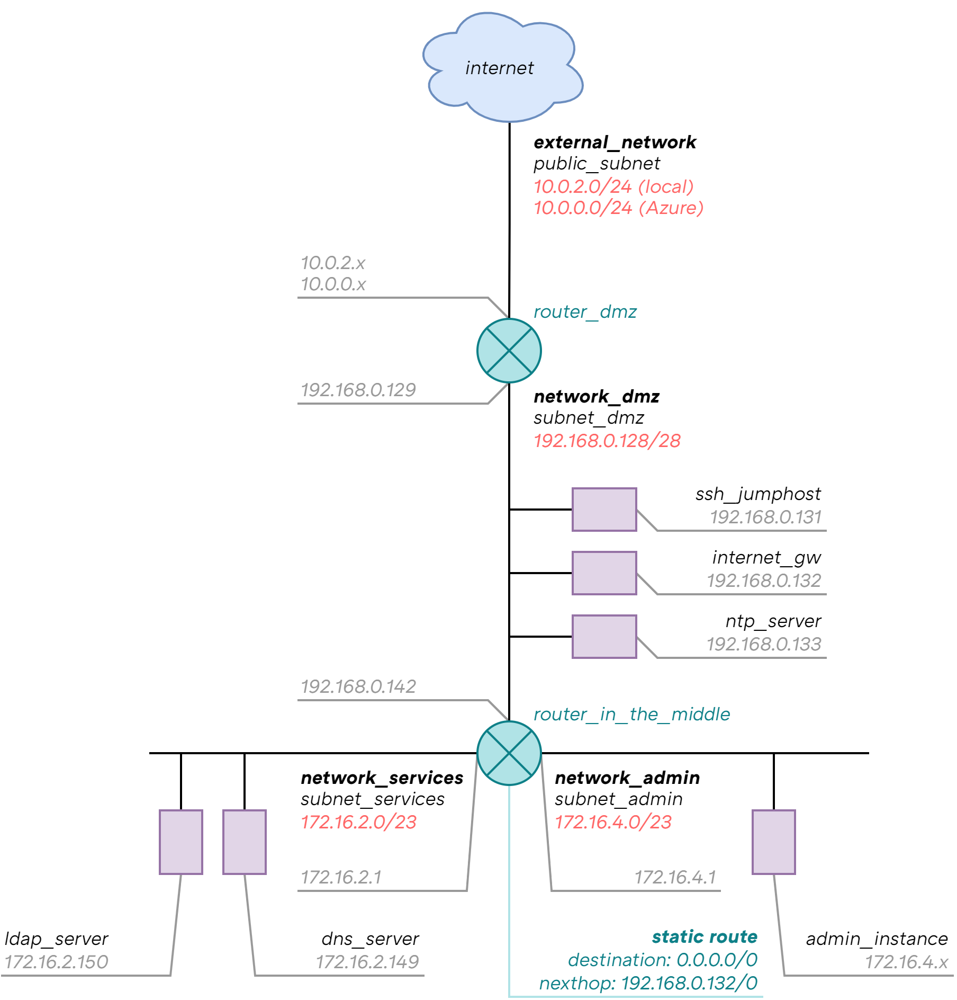
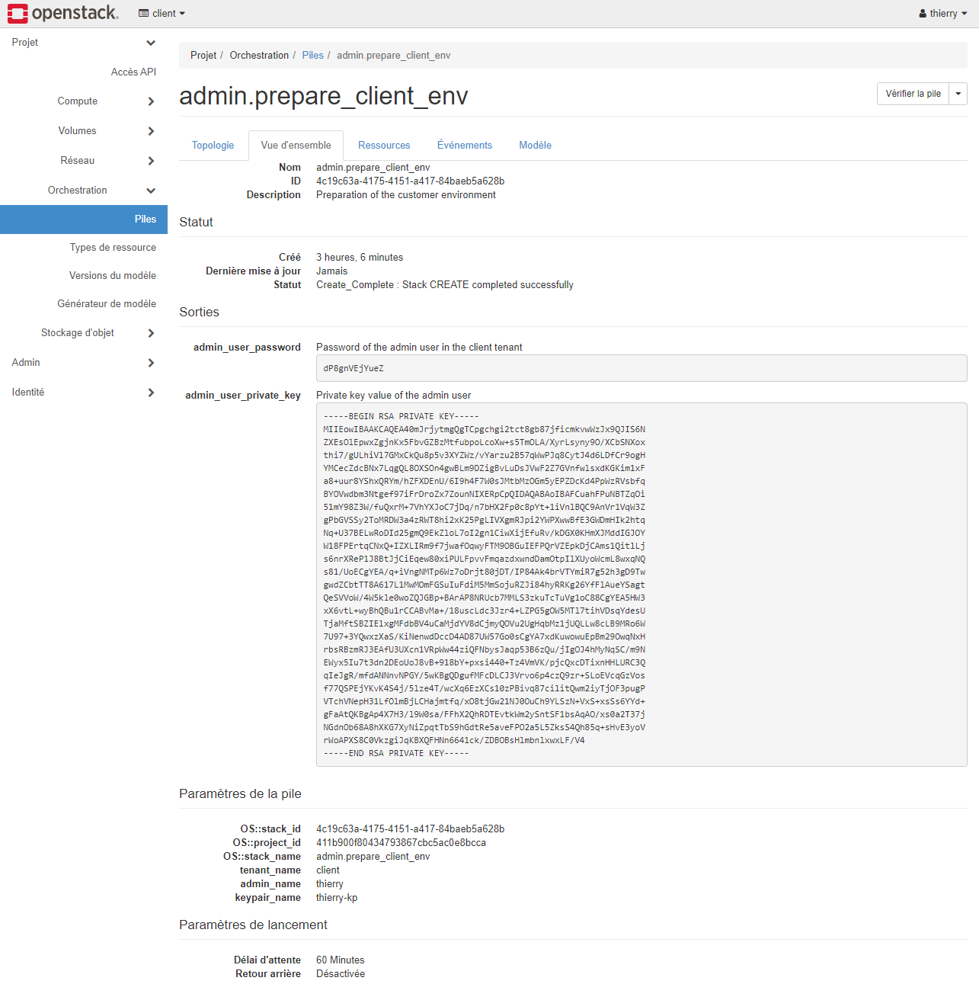
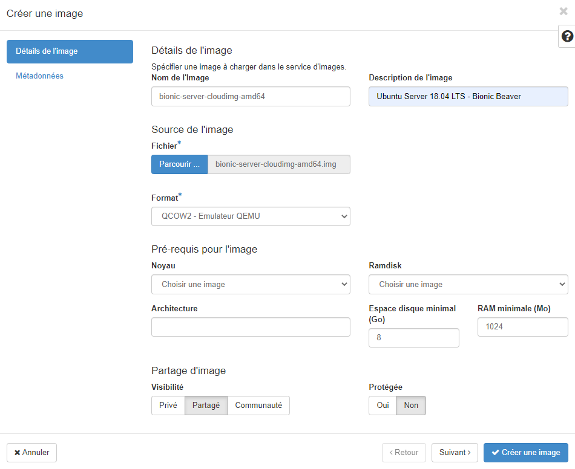
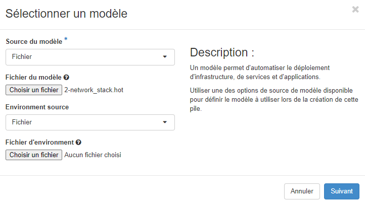
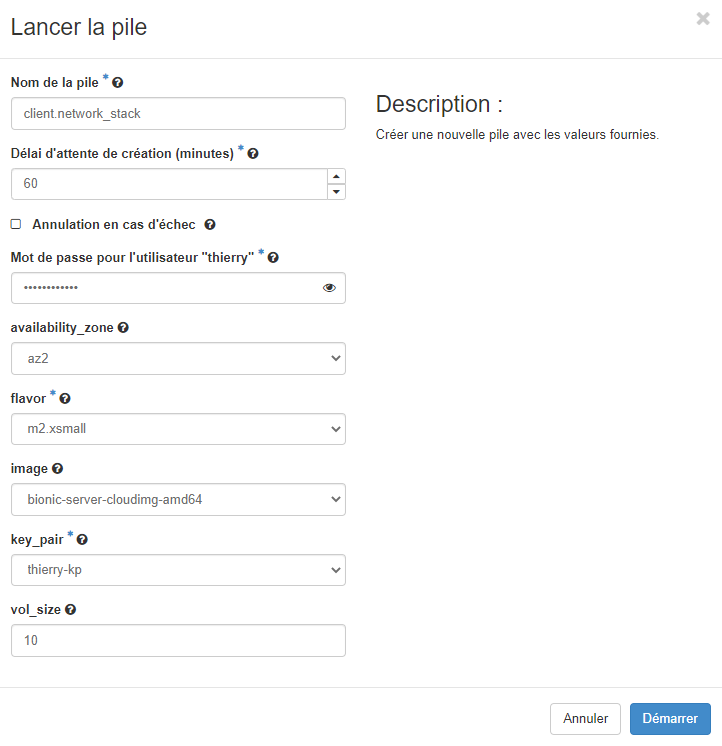
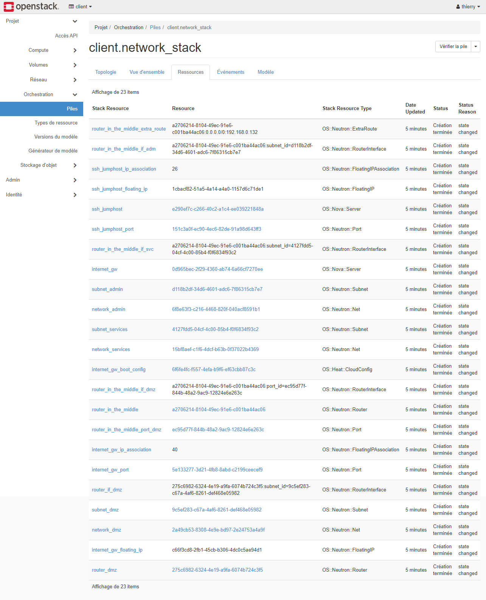
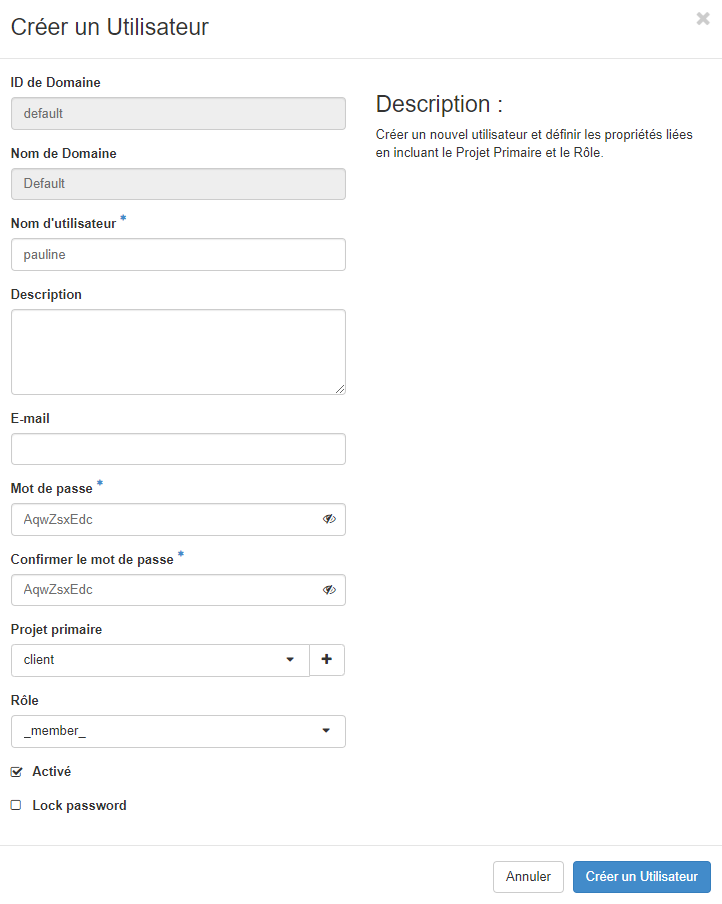
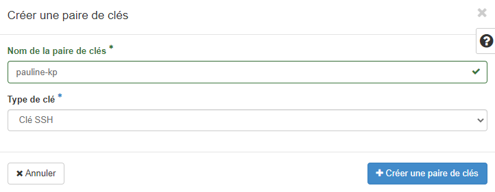

# OpenStack

**Module used in this project:**

* [`Nova`](https://opendev.org/openstack/puppet-nova/) -  (Compute)
* [`Neutron`](https://opendev.org/openstack/puppet-neutron/) - (Networking)
* [`Keystone`](https://opendev.org/openstack/puppet-keystone/) - (Identity)
* [`Glance`](https://opendev.org/openstack/puppet-glance/) - (Image Service)
* [`Heat`](https://opendev.org/openstack/puppet-heat/) - (Orchestration)
* [`Horizon`](https://opendev.org/openstack/puppet-horizon/) - (Dashboard)  

# Client tenant infrastructure

 

**For additional information about instances network configuration:**

|                           |   *ssh_jumphost*   |                        *internet_gw*                         |        *ntp_server*        |                      *ldap_server*                      |                      *dns_server*                      |
| :------------------------ | :----------------: | :----------------------------------------------------------: | :------------------------: | :-----------------------------------------------------: | :----------------------------------------------------: |
| **Floating IP**           |        yes         |                             yes                              |            yes             |                           no                            |                           no                           |
| **Routes**                |        yes°        |                             yes°                             |            yes°            |                           no                            |                           no                           |
| **DNS servers**           |    172.16.2.149    |                         172.16.2.149                         |        172.16.2.149        |                      172.16.2.149                       |                      172.16.2.149                      |
| **Security group**        | sg_ssh sg_icmp | sg_all_from_svc_network sg_all_from_adm_network sg_icmp | sg_ntp_service sg_icmp | sg_ssh_from_adm_network sg_ldap_service sg_icmp | sg_ssh_from_adm_network sg_dns_service sg_icmp |
| **Availability zone**     |        az2         |                             az2                              |            az2             |                           az1                           |                          az1                           |
| **Allowed address pairs** |         no         |                            yes°°                             |             no             |                           no                            |                           no                           |

###### (°) destination: 172.16.2.0/23, 172.16.4.0/23, nexthop: 192.168.0.142 (°°) ip_address: 0.0.0.0, mac_address: not_defined (by default - its own)  

# Simplified RACI

**This diagram helps to define the responsibilities of each party:**

|                                                              | *Cloud provider* | *Client* |
| ------------------------------------------------------------ | :--------------: | :------: |
| **Setting up the cloud**                                     |        x         |          |
| **Hosts configuration (networking, time synchronization, disabling SELinux, etc.)** |        x         |          |
| **Creation of availability zones**                           |        x         |          |
| **Extension of the cinder storage pool**                     |        x         |          |
| **Uploading instance images**                                |        x         |    x     |
| **Creation of the external network**                         |        x         |          |
| **Creation of predefined flavors°**                          |        x         |          |
| **Creation of the client environment°**                      |        x         |          |
| **Creation of predefined security groups in the client project°** |                  |    x     |
| **Creation of the entire network stack in the client project°** |                  |    x     |
| **Creation of all the basic services in the client project°** |                  |    x     |
| **Addition of new users in the client project**              |                  |    x     |
| **Addition of new keypairs in the client project**           |                  |    x     |
| **Addition and configuration of new networks and subnets in the client project** |                  |    x     |
| **Addition of new security groups in the client project**    |                  |    x     |
| **Addition of new services in the client project**           |                  |    x     |

###### (°) Can be automated via Heat (OpenStack orchestration)  

# User guide

The purpose of this user guide is to detail the various actions that can be carried out by the customer as part of the management of its infrastructure (see simplified RACI).

## Retrieve admin password and SSH private key

The provider automatically creates the client tenant. The username and password are then sent to the admin user of the client tenant. Moreover, a key pair is also created so that the admin user can create instances and connect to them.

**The SSH private key (and the password too) can be retrieved under the "Project" tab, then "Orchestration" and click on "admin.prepare_client_env_<client_id>": **

*The admin user is of course free to delete this key pair and create a new one. The creation of key pairs will be presented later in this user guide.*

## Upload an image

**This example shows how to upload an Ubuntu cloud image (Ubuntu Server 18.04 LTS - Bionic Beaver):**

1. Download the cloud image from the following link: https://cloud-images.ubuntu.com/bionic/current/bionic-server-cloudimg-amd64.img (the same goes for other Linux distributions)
2. Use your username and password to log in to your OpenStack tenant
3. Under the "Project" tab, then "Compute", click on "Images" then "Create Image"
4. Fill in the fields as follows and click on "Create Image":

## Deploy a stack (Heat)

**The customer can orchestrate the deployment of predefined security groups, the entire network stack, and basic services (NTP, DNS, LDAP) using Heat templates supplied by the provider:**

1. security_groups.hot
2. network_stack.hot
3. ntp_service.hot
4. dns_service.hot
5. ldap_service.hot

*The deployment of these configuration files must follow a specific order, as described above.*

**Here, how to deploy a stack:**

1. Use your username and password to log in to your OpenStack tenant (an account that has the rights to deploy stacks)
2. Under the "Project" tab, then "Orchestration", click on "Stacks" then "Launch Stack"
3. Select the template then click on "Next":

4. Fill in the fields as follows and click on "Launch":

5. Verify that the deployment went well:  

## Destroy a stack (Heat)

**Resources deployed via Heat can also be destroyed (in its entirety):**

1. Use your username and password to log in to your OpenStack tenant (an account that has the rights to destroy stacks)
2. Under the "Project" tab, then "Orchestration", select the stack to destroy and click on "Delete Stacks"

## Create an user

1. Use your admin username and password to log in to your OpenStack tenant
2. Under the "Identity" tab, click on "Users" then "Create user"
3. Fill in the fields as follows and click on "Create user":

*The "Role" field must correspond to the privileges you want to grant to the user.*

## Create a key pair

1. Use your username and password to log in to your OpenStack tenant
2. Under the "Compute" tab, click on "Key Pairs" then "Create Key Pair"
3. Fill in the fields as follows and click on "Create Key Pair":

*The private key will then be downloaded. Keep it in a safe place.*

